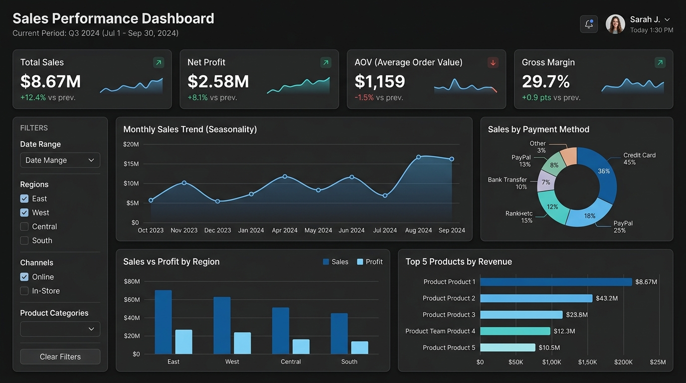

# Sales Performance Dashboard: Corporate Analytics Project

A professional, end-to-end data analytics and business intelligence project modeling a realistic retail enterprise dataset. This project demonstrates data engineering (synthetic generation & dirty data injection), ETL pipelines (Power Query M code & Python), spreadsheet analysis (Excel COM automation, dynamic Pivot Tables/Charts), and interactive BI reporting (Power BI semantic modeling & DAX measures).



---

## 1. Project Overview
This project provides a comprehensive analysis of sales performance across geography, product lines, categories, salespeople, and seasonal timelines. It mimics the analytical workflow of a Business / Data Analyst, delivering structured data schemas, programmatic cleansing, and interactive dashboard visuals to answer core executive business questions.

---

## 2. Business Problem
Enterprise executives require visibility into sales revenue, net profits, and discount efficiency to address several critical issues:
*   Which product categories and territories are driving growth vs. leaking profits?
*   Are sales discounts eroding net margins, particularly in specific sub-categories like Furniture/Tables?
*   How does seasonality affect logistics, stock forecasting, and monthly sales peaks?
*   Who are the top-performing sales representatives, and what strategies can be replicated across regions?

---

## 3. Project Objectives
*   **Generate Noisy Data:** Build a robust, realistic synthetic dataset of 7,500+ records containing intentional duplicates, nulls, casing issues, and invalid numerical anomalies.
*   **Etl pipeline:** Implement a data-cleaning schema via Python and Power Query M Code to standardize and validate the dataset.
*   **Excel Modeling:** Programmatically build a multi-tab workbook with 9 Pivot Tables, 5 Pivot Charts, and interactive Slicers on a formatted dashboard sheet.
*   **Power BI Reporting:** Design a robust semantic model with calendar dimension tables, advanced DAX measures, time intelligence, and KPI cards.
*   **Business Intelligence:** Extract 10 data-driven insights and actionable business recommendations.

---

## 4. Dataset Description
The dataset maps standard enterprise columns:
*   **Identifiers:** `Order ID`, `Customer ID`, `Product ID`
*   **Timestamps:** `Order Date`, `Ship Date`
*   **Dimensions:** `Customer Name`, `Region`, `State`, `City`, `Category`, `Sub-Category`, `Product Name`, `Salesperson`, `Payment Method`
*   **Metrics:** `Sales`, `Quantity`, `Discount`, `Profit`
*   **Engineered:** `Lead Time (Days)`, `Profit Margin %`, `Order Year`, `Order Month`, `Order Month Number`

A complete field-by-field reference is available in the [Data Dictionary](documentation/data_dictionary.md).

---

## 5. Data Cleaning Process
The raw data is processed using both Python and Excel Power Query to demonstrate proper data warehousing preparation:
1.  **Deduplication:** Remove exact duplicates (82 records removed).
2.  **Text Standardization:** Strip extra whitespace, apply Title Case, and resolve region inconsistencies (e.g., `WEST` $\rightarrow$ `West`).
3.  **Imputation:** Fill null customer names using Customer ID mapping, set missing payment methods to `Credit Card`, and estimate backordered `Ship Dates` at `Order Date + 4 days`.
4.  **Value Validation:** Force positive quantities (absolute values) and filter out sales $\le 0$.
5.  **Calculations:** Calculate shipping lead time, profit margins, and time hierarchy keys.

Detailed ETL rules and the complete M-Code are located in the [Data Cleaning Documentation](documentation/data_cleaning.md).

---

## 6. Excel Analysis Workbook
The final workbook [`excel/Sales_Analysis.xlsx`](excel/Sales_Analysis.xlsx) contains:
*   **Raw Data Sheet:** Original unprocessed dataset.
*   **Cleaned Data Sheet:** Cleaned dataset ready for modeling.
*   **Pivot Tables Sheet:** Contains 9 dynamic Pivot Tables:
    1.  Sales & Profit by Region
    2.  Sales by Category
    3.  Sales by Sub-Category
    4.  Monthly Sales Trend
    5.  Monthly Profit Trend
    6.  Top 10 Products by Revenue
    7.  Bottom 10 Products by Revenue
    8.  Salesperson territory rankings
    9.  Payment Method Distribution
*   **Dashboard Sheet:** Hides gridlines for a clean UI look and houses 5 Pivot Charts (Line, Column, Bar, Donut) and interactive Slicers (Year, Region, Category) connecting all tables together.

---

## 7. Power BI Dashboard Design
The semantic model connects the cleaned dataset to a custom Calendar table to enable robust date filtering:
*   **KPI Section:** Total Sales ($8.67M), Net Profit ($2.58M), Orders (7.4K), Quantity (37.8K), AOV ($1,159), and Margin (29.7%).
*   **Filter Section:** Interactive slicers for Year, Month Name, Region, State, Category, Sub-Category, and Salesperson.
*   **Visualizations:**
    *   *Monthly Sales Trend:* Line chart showcasing Q4 peaks.
    *   *Regional Sales & Profit:* Clustered column chart showing West, East, Central, and South.
    *   *Category Performance:* Stacked bar chart comparing Technology, Office Supplies, and Furniture.
    *   *Top 10 / Bottom 10 Products:* Ordered horizontal bar charts.
    *   *Payment Method Distribution:* Donut chart showing transaction volume share.
    *   *Salesperson Performance:* Ordered bar chart showing rankings.

---

## 8. DAX Measures
The semantic model includes core measures and time-intelligence calculations:
*   **Core KPIs:** `Total Sales`, `Total Profit`, `Total Orders`, `Total Quantity`, `Average Order Value`, `Profit Margin %`, `Average Discount`.
*   **Time Intelligence:** `Previous Month Sales`, `Previous Year Sales`, `YoY Sales Growth %`, `MoM Sales Growth %`.

The complete DAX code and relationship definitions are detailed in the [DAX Measures Reference](documentation/dax_measures.md).

---

## 9. Key Business Insights
*   **Overall Performance:** The company generated **$8,673,797.86** in sales with a **29.71%** net profit margin.
*   **Region:** The **East Region** is the leading market, contributing **$2,254,129.72** in sales and **$675,614.03** in profit.
*   **Category:** **Technology** is the most profitable category with an average margin of **51.49%** ($2.03M profit).
*   **Margin Leak:** The **Tables** sub-category generated a net loss of **-$205,767.84** due to excessive discounting (averaging 21.6%) and high shipping overheads.
*   **Seasonality:** Strong Q4 seasonality peaks in **December** (e.g., Dec 2023 hit **$386,144.99** in sales).

The complete, programmatically calculated insights report is available in the [Business Insights Report](documentation/business_insights.md).

---

## 10. Strategic Business Recommendations
1.  **Restrict Table Discounts:** Implement a hard limit of 15% on table promotions. Shift incentives away from volume sales to high-margin products.
2.  **B2B Enterprise Bundles:** Create B2B service bundle contracts for Technology products (Phones and Copiers) to capitalize on the high 51.5% profit margins.
3.  **Q4 Stock Optimization:** Increase stocking levels starting in September to mitigate shipping delays during the holiday peak season.
4.  **South Region Expansion:** Launch digital marketing campaigns in Florida and Georgia. The South has a high profit-to-revenue conversion but low current volume.

---

## 11. Tools & Technologies
*   **Web Frontend Dashboard:** React 18, Vite 5, Recharts, Lucide Icons, Vanilla CSS
*   **Data Generation:** Python 3.13, Pandas, Numpy, Faker
*   **ETL & Clean:** Excel Power Query (M Code), Pandas
*   **Spreadsheet Modeling:** Microsoft Excel (COM win32com Automation), Pivot Tables & Charts
*   **BI Visualization:** Microsoft Power BI Desktop, DAX, Tabular Modeling

---

## 12. Project Structure
```text
Sales-Performance-Dashboard/
│
├── src/                                  <-- React source code
│   ├── components/
│   │   ├── KpiCards.jsx                  <-- Metric summary cards
│   │   ├── SlicerPanel.jsx               <-- Expandable left filters
│   │   └── ChartGrid.jsx                 <-- Recharts graph rendering
│   ├── data/
│   │   └── cleaned_sales_data.json      <-- JSON dataset loaded into UI
│   ├── App.jsx                           <-- Core state, filtering & cockpit logic
│   ├── main.jsx                          <-- React entrypoint
│   └── index.css                         <-- Dark corporate style theme
│
├── data/
│   ├── raw_sales_data.xlsx
│   └── cleaned_sales_data.xlsx
│
├── excel/
│   └── Sales_Analysis.xlsx
│
├── powerbi/
│   └── Sales_Performance_Dashboard.pbix
│
├── documentation/
│   ├── data_dictionary.md
│   ├── data_cleaning.md
│   ├── business_insights.md
│   └── dax_measures.md
│
├── screenshots/
│   └── dashboard.png
│
├── scripts/
│   ├── generate_data.py
│   ├── clean_data.py
│   ├── build_excel_workbook.py
│   ├── verify_integrity.py
│   └── calculate_insights.py
│
├── package.json                          <-- Node project definition
├── vite.config.js                        <-- Vite dev settings
├── index.html                            <-- Main HTML entry point
└── README.md
```

---

## 13. How to Use

### Run the Interactive Web Dashboard:
1.  Open the workspace directory in a terminal.
2.  Install dependencies:
    ```bash
    npm install
    ```
3.  Start the development server:
    ```bash
    npm run dev
    ```
4.  Open the local URL in your browser: `http://localhost:3000/`.

### Excel & Power BI Integration:
1.  Open [`excel/Sales_Analysis.xlsx`](excel/Sales_Analysis.xlsx) to inspect the Excel Pivot dashboard, raw/cleaned tables, and Power Query queries.
2.  To explore the Power BI model, open [`powerbi/Sales_Performance_Dashboard.pbix`](powerbi/Sales_Performance_Dashboard.pbix) in Power BI Desktop, navigate to **Transform Data**, update the Source path to point to your local path of [`data/cleaned_sales_data.xlsx`](data/cleaned_sales_data.xlsx), and click **Refresh**.
3.  Copy the DAX measures from the [DAX Reference](documentation/dax_measures.md) to populate visuals.

---

## 14. Future Improvements
*   **Live DB Connection:** Connect Power Query, React, and Power BI directly to a PostgreSQL or SQL Server database.
*   **Automation:** Automate data extraction using Apache Airflow.
*   **Machine Learning:** Implement a forecasting model in Python to predict next month's sales based on seasonality.
