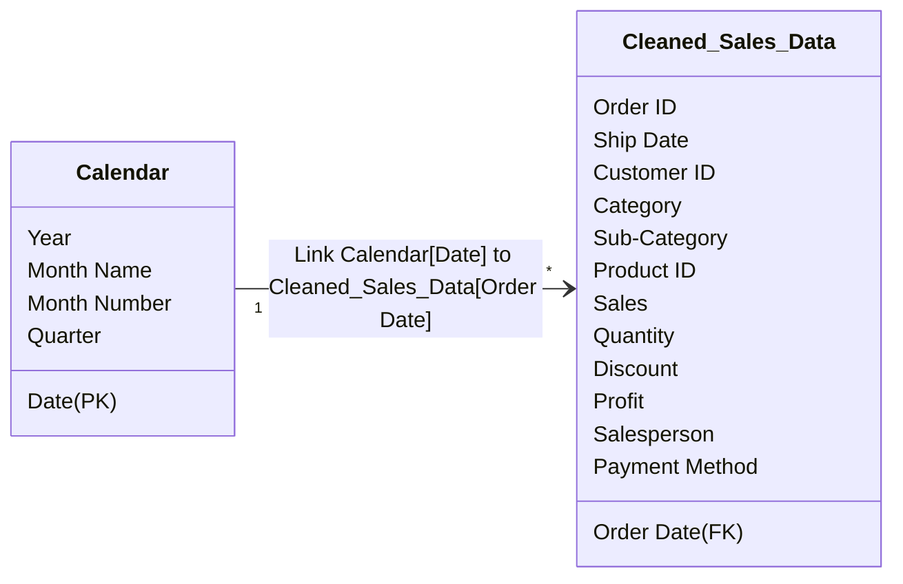

# Power BI Semantic Model & DAX Measures Reference

This document serves as the implementation guide for the **Power BI Semantic Model** and the corresponding **DAX (Data Analysis Expressions)** calculations used in the Sales Performance Dashboard.

---

## 1. Data Model Relationships

To support clean time-intelligence calculations, a standard star schema relationship is recommended:



### Date Table Setup
Create a dedicated `Calendar` table using the following DAX formula:

```dax
Calendar = 
ADDCOLUMNS(
    CALENDAR(MIN(Cleaned_Sales_Data[Order Date]), MAX(Cleaned_Sales_Data[Order Date])),
    "Year", YEAR([Date]),
    "Month Name", FORMAT([Date], "MMM"),
    "Month Number", MONTH([Date]),
    "Quarter", "Q" & FORMAT([Date], "Q"),
    "YearMonth", FORMAT([Date], "YYYY-MM")
)
```
*Note: Mark this table as a "Date Table" inside Power BI Desktop to enable time intelligence properties.*

---

## 2. Core Business KPI Measures

These DAX measures represent the primary business metrics shown in the dashboard KPI Cards:

### Total Sales
Sums the total gross revenue generated from sales.
```dax
Total Sales = SUM(Cleaned_Sales_Data[Sales])
```

### Total Profit
Sums the net profit.
```dax
Total Profit = SUM(Cleaned_Sales_Data[Profit])
```

### Total Orders
Counts the unique number of transactions based on unique Order IDs.
```dax
Total Orders = DISTINCTCOUNT(Cleaned_Sales_Data[Order ID])
```

### Total Quantity
Calculates the total number of items sold.
```dax
Total Quantity = SUM(Cleaned_Sales_Data[Quantity])
```

### Average Order Value (AOV)
Calculates the average dollar value of each transaction.
```dax
Average Order Value = DIVIDE([Total Sales], [Total Orders], 0)
```

### Profit Margin %
Calculates the profit margin percentage.
```dax
Profit Margin % = DIVIDE([Total Profit], [Total Sales], 0)
```

### Average Discount
Calculates the average discount percentage applied across all sales.
```dax
Average Discount = AVERAGE(Cleaned_Sales_Data[Discount])
```

---

## 3. Time Intelligence & Growth Calculations

These DAX measures calculate performance changes across different calendar periods:

### Previous Month Sales (PM Sales)
Finds the sales value in the preceding month.
```dax
Previous Month Sales = 
CALCULATE(
    [Total Sales], 
    DATEADD('Calendar'[Date], -1, MONTH)
)
```

### Previous Year Sales (PY Sales)
Finds the sales value in the same period of the previous calendar year.
```dax
Previous Year Sales = 
CALCULATE(
    [Total Sales], 
    SAMEPERIODLASTYEAR('Calendar'[Date])
)
```

### Month-over-Month (MoM) Sales Growth %
Calculates the percentage change in sales revenue from the previous month.
```dax
MoM Sales Growth % = 
VAR PrevSales = [Previous Month Sales]
RETURN
    DIVIDE([Total Sales] - PrevSales, PrevSales, 0)
```

### Year-over-Year (YoY) Sales Growth %
Calculates the percentage change in sales revenue from the same period in the previous year.
```dax
YoY Sales Growth % = 
VAR PrevSales = [Previous Year Sales]
RETURN
    DIVIDE([Total Sales] - PrevSales, PrevSales, 0)
```

### Previous Month Profit
Finds the net profit in the preceding month.
```dax
Previous Month Profit = 
CALCULATE(
    [Total Profit], 
    DATEADD('Calendar'[Date], -1, MONTH)
)
```

### Month-over-Month (MoM) Profit Growth %
Calculates the percentage change in net profit from the previous month.
```dax
MoM Profit Growth % = 
VAR PrevProfit = [Previous Month Profit]
RETURN
    DIVIDE([Total Profit] - PrevProfit, PrevProfit, 0)
```

---

## 4. Visual Configurations & Formatting Rules

Apply these format rules inside the Power BI Properties panel to maintain professional reporting layout:

1.  **Sales, Profit, AOV:** Set format to `Currency ($)` with `0 decimal places` for clean visual charts, and `2 decimal places` for transaction tooltips.
2.  **Profit Margin %, Average Discount, YoY/MoM Growth %:** Set format to `Percentage (%)` with `1 or 2 decimal places`.
3.  **Total Orders, Total Quantity:** Set format to `Whole Number` with thousands separators enabled.
4.  **Date Slicers:** Use calendar hierarchy or dynamic dropdown slicers linked to `Calendar[Year]` and `Calendar[Month Name]`. Set sorting on `Calendar[Month Name]` by `Calendar[Month Number]` ascending to prevent alphabetical month lists (e.g. Apr, Aug, Dec... $\rightarrow$ Jan, Feb, Mar...).
